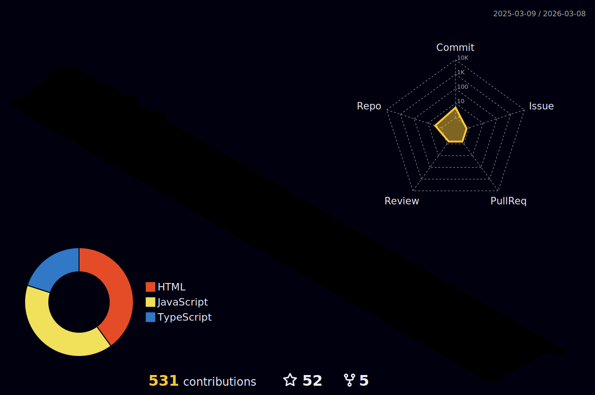

<h1 align="center" >नमस्ते 🙏 </h1>
<h1 align="center" >My name is Ranjeet Kumar ❤️ </h1>


## A passionate Java Developer from India

```javascript
const aboutMe = {
  pronouns: "he" | "him",
  code: ["JavaScript", "TypeScript", "Java", "HTML", "CSS", "SQL"],
  technologies: {
    frontEnd: {
      js: ["React", "Next.js", "React Native"],
      stateManagement: ["Redux", "Context API"],
      testing: ["Vitest", "React Testing Library"],
      css: ["Tailwind CSS", "Bootstrap", "Material UI", "Chakra UI", "Styled Components"],
    },
    backEnd: {
      java: ["Spring Boot", "Spring Security", "Spring Data JPA"],
      node: ["Express"],
      database: ["PostgreSQL", "MySQL", "MongoDB"],
      cms: ["Strapi"],
    },
    devOps: {
      tools: ["Docker", "GitHub Actions", "AWS EC2", "S3", "Nginx", "PM2"],
    },
    misc: {
      analytics: ["Mixpanel"],
      chatSupport: ["Freshchat"],
      mobile: ["React Native"],
      auth: ["JWT", "Session-based", "Third-party OAuth"],
    },
  },
};
```

- 🌍  I'm From Bihar, India
- ✉️  You can contact me at [ranjeet030200@gmail.com](mailto:ranjeet030200@gmail.com)
- 🧠  I'm learning JAVA Backend

<a href="https://twitter.com/Ranjeet91626904" target="_blank" rel="noreferrer"></a><a href="https://www.github.com/ranjeet-zet" target="_blank" rel="noreferrer"></a>

[](https://ranjeet-zet.github.io)
[](https://www.linkedin.com/in/ranjeet-jd/)

[](https://twitter.com/Ranjeet91626904)


<h1> Skills </h1>


### Familiar Tech Stack:

<!-- coding boy -->


<!-- language -->

[](http://ranjeet-zet.github.io/)

<br/>

### Used Tools:

[](http://ranjeet-zet.github.io/)


<br />

<h1>Interests</h1>

- Explore new Tech 💻
- Travel & Ride 🌎


<!-- <p align="left"> <a href="https://www.github.com/ranjeet-zet" target="_blank" rel="noreferrer"></a> <a href="https://www.linkedin.com/in/Ranjeet91626904/" target="_blank" rel="noreferrer"></a> <a href="http://www.medium.com/anannya.sharma" target="_blank" rel="noreferrer"></a> <a href="https://www.twitter.com/anannya_sharma_" target="_blank" rel="noreferrer"></a> <a href="https://www.youtube.com/c/ucznvxhf2lnxsgrxvnepwcjq" target="_blank" rel="noreferrer"></a></p> -->

<h1> Badges </h1>

<b>My GitHub Stats</b>

[](https://github.com/ryo-ma/github-profile-trophy)

<a href="http://www.github.com/ranjeet-zet"></a>

<a href="http://www.github.com/ranjeet-zet"></a>

<a href="http://www.github.com/ranjeet-zet"></a>

<a href="https://github.com/ranjeet-zet" align="left"></a>



