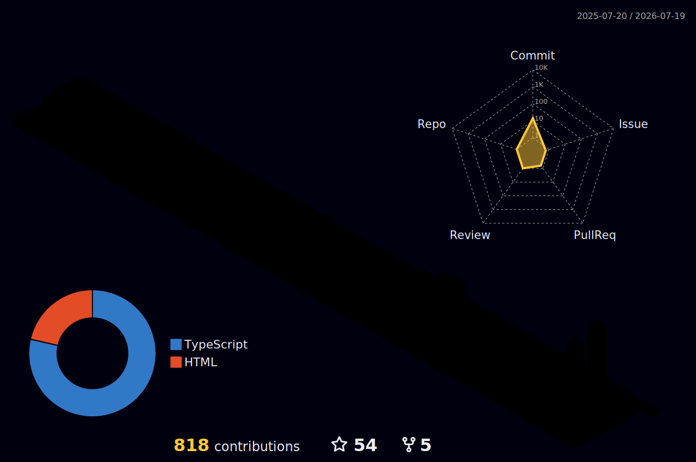

<h1 align="center">नमस्ते 🙏</h1>
<h1 align="center">My name is Ranjeet Kumar ❤️</h1>


## 🚀 Software Engineer | React Native · Next.js · Spring Boot | Fintech & Full Stack

```javascript
const aboutMe = {
  pronouns: "he" | "him",
  location: "Bengaluru, Karnataka, India",
  currentRole: "Software Engineer @ ZET (Onecoders)",
  experience: "2+ years in Fintech & Full Stack Development",
  code: ["JavaScript", "TypeScript", "Java", "Python", "HTML", "CSS", "SQL"],
  technologies: {
    mobile: {
      frameworks: ["React Native", "Expo SDK"],
      platforms: ["Android (Java/Kotlin)", "iOS"],
      nativeModules: true,
    },
    frontEnd: {
      js: ["React.js", "Next.js", "React Native"],
      stateManagement: ["Redux.js", "React Query", "Context API"],
    },
    backEnd: {
      java: ["Spring Boot", "Spring Security", "OpenJPA"],
      node: ["Node.js", "Express.js"],
      api: ["REST API Design"],
      database: ["MySQL", "MongoDB", "Redis"],
    },
    cloud: {
      providers: ["AWS", "GCP", "Cloudflare"],
      cicd: ["GitHub Actions", "CI/CD"],
    },
    tools: ["Git", "GitHub", "Jira", "Figma", "Sentry", "Freshdesk"],
  },
};
```

- 🌍 Based in **Bengaluru, Karnataka, India** (from Bihar)
- ✉️ Reach me at [ranjeet030200@gmail.com](mailto:ranjeet030200@gmail.com)
- 📱 Phone: +91 9162690495
- 💼 Currently: **Software Engineer** at ZET (Onecoders)
- 🌐 Portfolio: [amrutkaal.com](https://amrutkaal.com)
- 🔗 LinkedIn: [linkedin.com/in/ranjeet-jd](https://linkedin.com/in/ranjeet-jd)

---

## 💼 Experience

| Role | Company | Period |
|------|---------|--------|
| Software Engineer | ZET (Onecoders) | Jun 2025 – Present |
| Associate Software Engineer | ZET (Onecoders) | Dec 2024 – Jun 2025 |
| Software Engineer Intern | ZET (Onecoders) | Jun 2024 – Dec 2024 |

---

## 🎓 Education

| Degree | Institution | Year |
|--------|-------------|------|
| Computer Programming | Masai School | 2022 – 2024 |
| BTech – Electrical & Electronics Engineering | Gulzar College of Engineering | 2018 – 2022 |

---

## 🛠️ Projects

### 🌟 [Amrutkaal](https://amrutkaal.com)
A free, ad-free, full-stack daily Hindu Panchang and Vedic calendar web application.

**Tech Stack:** Next.js · Node.js · Python · Swiss Ephemeris

---

## 🧰 Skills

**Mobile:** React Native · Expo SDK · Android (Java/Kotlin) · iOS · Native Modules

**Frontend:** React.js · Next.js · Redux.js · React Query · TypeScript · HTML/CSS

**Backend:** Spring Boot · Spring Security · Node.js · Express.js · REST API · OpenJPA

**Database:** MySQL · MongoDB · Redis · NoSQL

**Cloud & DevOps:** AWS · GCP · Cloudflare · CI/CD (GitHub Actions)

**Tools:** Git · GitHub · Jira · Figma · Sentry · Freshdesk

---

<h1>Interests</h1>

- Explore new Tech 💻
- Travel & Ride 🌎
- Fintech & Full Stack development 📱

---

<h1>Badges</h1>

[](https://github.com/ryo-ma/github-profile-trophy)

<b>My GitHub Stats</b>

<a href="http://www.github.com/ranjeet-zet"></a>

<a href="http://www.github.com/ranjeet-zet"></a>

<a href="http://www.github.com/ranjeet-zet"></a>

<a href="https://github.com/ranjeet-zet" align="left"></a>


[]
