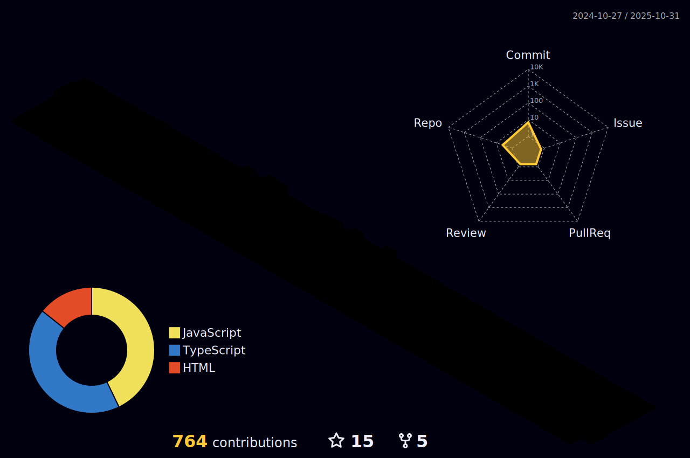

<h3 align="center" >I,m Masai student</h3>

<h1 align="center" >नमस्ते 🙏 </h1>
<h1 align="center" >My name is Ranjeet Kumar ❤️ </h1>

## A passionate MERN Stack developer proficient in Web architecture, NodeJs, React, JavaScript, HTML, CSS, Data Structures, and Algorithms

- 🌍  I'm From Bihar, India
- ✉️  You can contact me at [ranjeet030200@gmail.com](mailto:ranjeet030200@gmail.com)
- 🧠  I'm learning MERN Stack

<h1> Skills </h1>

### Familiar Tech Stack:

<!-- coding boy -->

<!-- language -->

 

### Used Tools:

 

<h1>Interests</h1>

- Explore new Tech 💻
- Travel & Ride 🌎

<!-- 
     
 -->

<h1> Badges </h1>

<b>My GitHub Stats</b>

